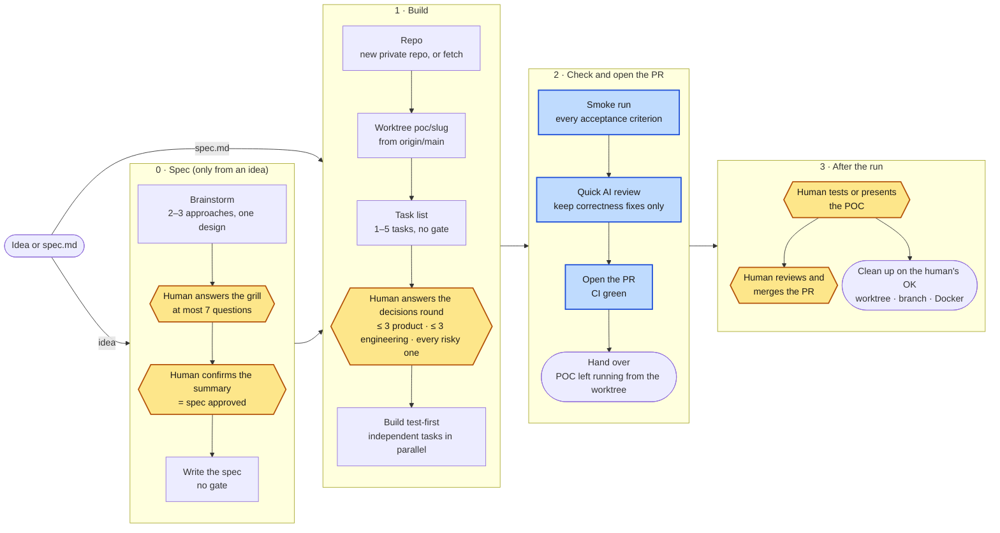

# `/ship-fast`: the light path

An hour-sized proof of concept skips the gates. The human still makes
every product call, through a capped number of questions, and the run stops
at an open PR with green CI and the POC running. The human merges it. The
command itself is [`plugin/commands/ship-fast.md`](../plugin/commands/ship-fast.md).

Amber: a human decision. Blue: an automatic check. A product or risky
question that comes up later is asked inline and the run continues. The run
stops only on the rules in the command: no acceptance criteria, a red
baseline, or a smoke run or CI still red after two fixes.
