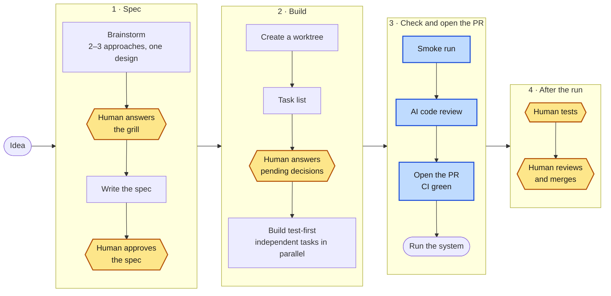

# `/ship-fast`: the light path

The path for an hour-sized proof of concept, from an idea to a pull request
the human merges. The command itself is
[`plugin/commands/ship-fast.md`](../plugin/commands/ship-fast.md).

Amber: a human decision. Blue: an automatic check.
